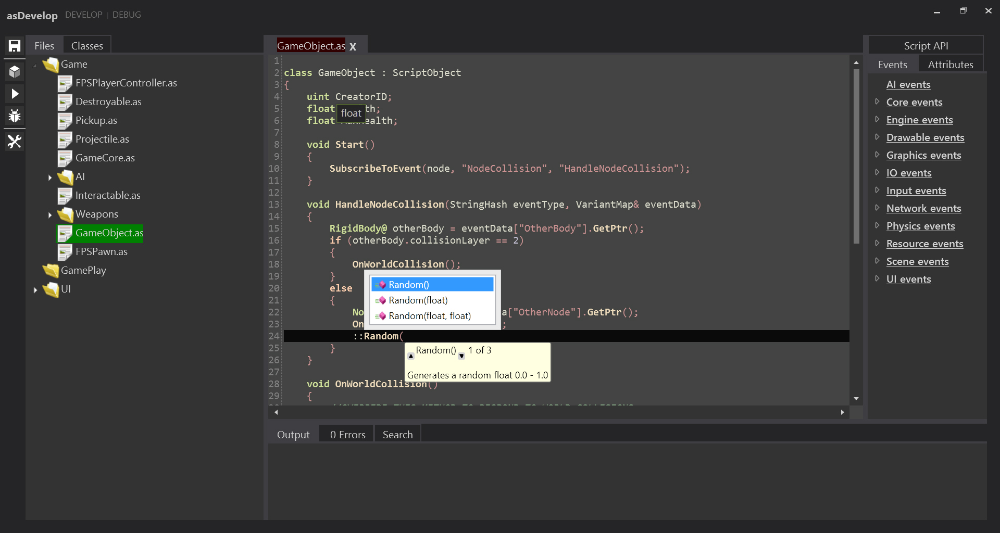

# UrhoAngelscriptIDE
An IDE and Debugger for Angelscript with Urho3D.

## NuGet dependencies

Newtonsoft Josn.NET, WebSocket4Net, and AvalonEdit

FirstFloor.ModernUI included (slightly tweaked)

### Critical Todo's That May Interfere with usages

* Code editors for the IDE/Debug views need to be consolidated
* Saving remote files (received from debug server) locally, in the case of debugging the local machine, this is unnecessary as the saving will send the file data over the connection where the debug daemon will save it

# Running the IDE

After compiling the project, your application directory must contain a "bin" directory in the location of the exe. In this directory place your ScriptCompiler.exe and drop a generated ScriptAPI.dox and if available also a "dump.h" header dump to have intellisense ready without having to compile first.

# IDE Functionality
The IDE is focused on directories instead of projects/solutions. Select the bin directory of your project, the parent directory will be used as the source tree for the ScriptCompiler's dump.

Presently only, text, XML, and Angelscript (.as) files may be edited. Angelscript files support intellisense. XML assistance is a WIP pending finishing XSD specs for all Urho3D xml file types.

**Intellisense** requires a successful compilation in order to function, or it will fallback on a default header dump that it will parse for generic Urho3D specific intellisense.

### File Tree

The file tree contains all files and folders below the selected path. .as, .xml, and .txt files can be opened by double clicking. Folder context menu options are to create a new file, new folder, rename, or delete. File context menu options are to rename, edit, or delete.

### Code Editor

* Ctrl + F = Search/Find

Context Menu:

* Compile
* Create a template ScriptObject
* Insert a #include by browsing for the file
* Insert doxygen style comment
* Insert doxygen style property comment
* Insert a snippet
* Common edit operations

### Class Browser

The class information is created by parsing the header dumps generated by the script compiler. A type hierarchy is built that is used both for displaying the class browser and for intellisense functionality.

### Code Snippets

If a folder named "snippets" exists in the directory of the IDE's executable it will be scanned for XML files to be loaded as snippets. Snippets may have "inputs" which are inserted into the snippet code using a {{mustache}} style marking. Snippets can also have "options" for which code blocks may depend on one or many options using "requires."

Snippet XML example:

    <snippet name="Test Options" extension=".as">
        <input name="Test Input" key="testin" />
        <option name="Include Second" key="second" />
        <code><![CDATA[
    void {{testin}}() {
        insert some cool code!
    }
    ]]>
        </code>
        <code requires="second"><![CDATA[
    void Start() {
        insert some cool code!
    }
    ]]> 
        </code>
    </snippet>

"Options" are presented as checkboxes, and "inputs" as text fields.

### Attributes Browser

The Attributes browser is populated from parsing the Latex output of the scriptcompiler's dump.

The tree consists of entities (Scene/Node/Components) registered to the Urho3D engine and each record contains a list of the attributes registered for it and the attributes type. Right clicking on an attribute will bring up a context menu with options to copy either a "getter" or a "setter" for the attribute selected - which will remove any risk of a typo.

### Events Browser

The events browser is populated from parsing the Latex output of the scriptcompiler's dump.

Events are grouped by Category, Event, Parameters.

Right-clicking on the Event or Parameters will bring a context menu with clipboard options.

In the case of an Event you can copy a template event subcribtion function call, unsubribtion, or generic event handler for the event.

For parameters the only current option is to copy the parameter getter (eventData["ParamName"]).

### Console Log

Contains verbatim output from the last compilation action.

### Error List

If a compilation attempt fails the error log will be parsed and the messages will appear here. The tab will include a bright red 'X' along with a count of the errors. Each error contains basic summary information and may be double clicked to navigate directly to the location of the error.

Because of how angelscript detects errors, most errors will be reported as being on the line after the error, so investigate everything around the large red squiggly line if in doubt.

### Search

Search functionality is provided by plugins that contain classes implementing ISearchService. Search "plugins" may be selected and will populate the search list with results. Included Search plugins are Code (.as files), XML (.xml files) and All files.

Search plugins feed their results into a ISearchPublisher interface and it is thread safe for them to do such and it is recommended that you run your search in a thread ... don't be Visual Studio, don't freeze the IDE because you're searching.

## Compiling
The executable directory must contain a bin folder into which you place the ScriptCompiler executable.
The IDE will run and feed parameters to the compiler as a slave process. Commandline output from the compiler is piped
into the IDE where it is parsed to scan for error messages.

After a successful compilation the script compiler will be used again in order to generate Latex documentation dumps and a header file for the script types. The IDE will parse these files to generate documentation and class hierarchies.

**It's recommended to modify your scriptcompiler to generate the dump files AFTER first compiling the code.** This way the header dump will contain definitions for the script classes, functions, and variables found in your files.

# Debugger Functionality

### Connections

You may connect to a debug daemon for the launch screen of the IDE or use the the "Debug" link at the top to go to the debugger without connection.

If the Debugger is not connected to an asPEEK daemon it will display a "Disconnected from server..." bar at the bottom. In the bar you may enter the address of the daemon you wish to connect to and attempt to connect/reconnect.

### Remote Files

When connected to a daemon you'll receive a list of remote files. Double clicking on any file will open it in the editor. In the editor you may use the margin to set/unset breakpoints.

### Breakpoints

Breakpoints may be set/unset in the editor. A list of breakpoints is available in which you may reset/unset breakpoints, or use delete to remove the breakpoint completely.

### Execution Control

When execution is halted you may use the buttons at the top, left, or the shortcuts to Continue (F5), Step Over (F10), Step-In (F11), or Step-Out (Shift + F11)

### Callstack

When execution is halted the callstack will be displayed. The topmost entry is the current position. Double click on any callstack entry will open the file in question (if not opened) and move the focus to the line.

### Locals, This, and Watches

When execution halts a full list of the local variables on the stack, the "this" object (if it exists), and the values of globals will be sent to the debugger. They may be seen in their respective tabs. Double clicking a leaf in these views will edit the value (if possible), and right clicking will allow the placement of a "watch." Hovering over a complex type will reveal the type name (Vector3, RigidBody, etc)

Many Urho3D types will display additional information, such as the pointer address in hex, the size of a resource, etc.

During each step (or new halt) the values of "watched" variables will be re-evaluated if possible. You may force re-evaluation, and may manually enter the path to the variable to watch.
